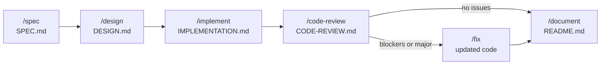

# Ptah

Ptah is a spec-driven workflow, using slash commands. Each command has a single responsibility, produces a markdown artifact, and waits for your review before suggesting the next step.

---

## Philosophy

- **Spec before code** — define what to build before building it
- **One command, one responsibility** — no command does more than one thing
- **You stay in control** — every step produces an artifact you review before moving on
- **Resume anytime** — `LOGS.md` tracks the full session history so you can pick up after days away
- **Service-agnostic** — optional integration with JIRA, Linear, GitHub, or any MCP-backed ticket service through Ptah config

---

## The workflow



---

## Spec identifiers

Every spec `/spec` creates gets a folder named `ptah-<n>-<slug>` (e.g. `ptah-3-user-login`). Every command after that takes just the number — `/design 3`, `/fix 3`, `/resume 3` — the full folder name works too, but the number is the fast path.

Full details — how numbers are assigned, how identifiers resolve, and where they're displayed — live in [`RULES.md`](./.claude/ptah/RULES.md) under "Spec identifiers".

---

## Ptah config (optional)

If your project uses an external ticket service (JIRA, Linear, GitHub), drop a `.claude/ptah/ptah.yml` at the project root to wire it up. `/spec` will then accept a flag like `--jira PROJ-1234` and pull the ticket content into the spec automatically.

The same config file also controls per-command behavior — for example, `commands.fix.mode` sets the default mode for `/fix` (see the `/fix` section below).

Projects without Ptah config run with sensible defaults — nothing breaks.

See `ptah.example.yml` for a working template.

---

## Commands

Commands fall into two groups: meta-commands for navigation, and workflow commands.

### Meta-commands

#### `/status [--all]`
Lists all in-flight specs with their current state — what's paused, what's active, what's just started. By default hides completed work; pass `--all` to include it. Read-only — never modifies any file.

Use this as your first command when sitting down to a clean session.

**Produces:** nothing — just a printed report

---

#### `/resume <n>`
Reloads the full working context for a spec — the project rules, the session history, and every relevant artifact produced so far. The agent ends up primed to run the next workflow command with full continuity, as if the session never ended. Read-only — does not run the next command and does not append to `LOGS.md`.

Accepts the spec number (`3`), `ptah-3`, or the full folder name — see **Spec identifiers** above.

Use this at the start of a new session whenever you're continuing in-flight work.

**Produces:** nothing — just primes the agent's context

---

### Workflow commands

#### `/spec <feature-name> [--<source> <id>]`
Starts a guided conversation to define a solid use case. Creates the full spec folder structure — auto-numbered as `ptah-<n>-<slug>` — and fills `SPEC.md` through a series of questions, one at a time.

If Ptah config is present and you pass a source flag (e.g. `--jira PROJ-1234`), the ticket content is pulled in and pre-fills relevant fields. You still review and confirm everything.

**Produces:** `.claude/specs/ptah-<n>-<slug>/SPEC.md`

---

#### `/design <n>`
Reads `SPEC.md` and any files in `/refs`, asks clarifying questions if anything is unclear, then produces a thorough technical design covering architecture, data model, API, UI, file structure, and business logic.

**Produces:** `.claude/specs/ptah-<n>-<slug>/DESIGN.md`

---

#### `/implement <n>`
Reads `DESIGN.md` and implements the feature exactly as designed. Documents what was built, files created/modified, and any deviations from the design.

**Produces:** `.claude/specs/ptah-<n>-<slug>/IMPLEMENTATION.md` + code

---

#### `/code-review <n>`
Reviews the implemented code against the spec and design. Documentation only — no code changes. Findings are prioritized as:

| Icon | Level | Action |
|------|-------|--------|
| 🔴 | Blocker | Must fix before moving forward |
| 🟡 | Major | Should fix before moving forward |
| 🟢 | Minor | Nice to fix |
| 💡 | Suggestion | Optional |

**Produces:** `.claude/specs/ptah-<n>-<slug>/CODE-REVIEW.md`

---

#### `/fix <n> [--auto | --plan | --interactive] [--include-minor | --blockers-only]`
Reads `CODE-REVIEW.md` and applies fixes for all 🔴 blockers and 🟡 major issues. Supports three modes that control how much the agent asks before applying:

| Mode | Behavior |
|------|----------|
| `auto` | Apply all in-scope fixes silently. Report at the end. |
| `plan` | Show a one-line-per-finding plan, wait for one confirmation, apply all in one pass. **Default.** |
| `interactive` | Ask per finding before applying. User can skip individual findings. |

Mode is resolved with precedence **flag > config > default (`plan`)**. The default mode can be set in `.claude/ptah/ptah.yml` under `commands.fix.mode`.

Minors and suggestions are deferred by default. Pass `--include-minor` (or set `commands.fix.include_minor: true` in config) to include 🟢 minor issues in the run. 💡 suggestions are never auto-fixed.

Regardless of mode, the **Stop and ask** rule from `RULES.md` still applies — `auto` does not bypass judgment for ambiguous fixes, design changes, or new dependencies.

**Produces:** Updated code + fix summary in `CODE-REVIEW.md`

---

#### `/document <n>`
The final step. Writes a clean, human-readable summary of the completed feature. Guards against documenting incomplete work — warns if there are unresolved blockers.

**Produces:** `.claude/specs/ptah-<n>-<slug>/README.md`

---

## Folder structure

Ptah is split across three locations under `.claude/`:

- **`commands/ptah/`** — the slash command definitions (lives where Claude Code expects commands)
- **`ptah/`** — Ptah's own config and reference docs
- **`specs/`** — your work product, created as you use Ptah

```
.claude/
  commands/
    ptah/                         ← Ptah's slash commands
      status.md                   ← list in-flight specs
      resume.md                   ← load context for one spec
      spec.md
      design.md
      implement.md
      code-review.md
      fix.md
      document.md

  ptah/                           ← Ptah's config + docs
    README.md                     ← this file
    RULES.md                      ← cross-cutting agent rules (referenced from CLAUDE.md)
    ptah.yml                      ← optional, wires up external ticket services
    ptah.example.yml              ← template for ptah.yml
    guides/
      logs-format.md              ← strict schema for LOGS.md entries

  specs/ptah-<n>-<slug>/          ← created by /spec, one per feature — see "Spec identifiers"
    LOGS.md                       ← session journal — read first when resuming
    SPEC.md                       ← use case, problem, acceptance criteria
    DESIGN.md                     ← technical approach, file plan, data model
    IMPLEMENTATION.md             ← what was built, deviations, known issues
    CODE-REVIEW.md                ← findings + fix summary
    README.md                     ← final summary (produced by /document)
    refs/                         ← screenshots, mockups, schema snippets
```

And the project root holds:

```
CLAUDE.md           ← project-wide rules (stack, conventions, logging discipline)
```

---

## LOGS.md

Every command appends an entry to `LOGS.md` when it completes, and **change entries** are appended in between as work happens (decisions, deviations, scope changes, blockers, corrections). Reading `LOGS.md` top-to-bottom shows the full timeline of a feature.

A quick taste:

```markdown
## 2026-04-23 09:14:22 — /spec completed
- Feature: account creation with excluded from net worth toggle
- Source: PROJ-42
- Key decisions: toggle defaults to false
- Next step: /design

## 2026-04-23 14:22:18 — change during /implement
- Trigger: agent decision
- Type: deviation
- What: used Zustand instead of useReducer for form state
- Why: form grew to 12 fields, useReducer was getting unwieldy
- Impact: new dependency, IMPLEMENTATION.md will flag under "Deviations"
```

The full schema — required fields per command, change entry format, and rules — lives in [`guides/logs-format.md`](./guides/logs-format.md).

The mid-session logging discipline (when to log, when not to) lives in `CLAUDE.md` under "Logging discipline".

When resuming after a break, run `/status` to see what's in flight, then `/resume <n>` to load context for the one you want to continue.

---

## Getting started

See [`INSTALL.md`](./INSTALL.md) for setup steps.

---

## Tips

### Sitting down to a clean session
- Run `/status` first — it shows what's in flight without needing to remember anything
- Pass `--all` to also see completed work (useful for audits or briefing teammates)
- Once you know what to continue, run `/resume <n>` — it loads the project rules, session history, and every relevant artifact into the agent's context, so the next workflow command runs with full continuity
- `/status` and `/resume` are read-only — they never modify files or append to `LOGS.md`

### Working a feature
- Every spec gets a number the moment `/spec` creates it — use that number (`/design 3`, `/fix 3`, etc.) for every command after `/spec`, rather than typing the full folder name
- Add screenshots, mockups, or schema snippets to `refs/` before running `/design` — the agent will use them
- If `/design` produces open questions, resolve them before running `/implement`
- `/code-review` is documentation only — it never touches code
- `/fix` defaults to `plan` mode — you see the full plan before any code is touched. Set `commands.fix.mode: auto` in `ptah.yml` if you'd rather have it just apply everything, or pass `--auto` on a per-run basis. Use `--interactive` when the review found something risky and you want to triage finding by finding.
- `/fix` skips 🟢 minor issues by default — pass `--include-minor` or set `commands.fix.include_minor: true` to include them. 💡 suggestions are never auto-fixed.
- `/document` guards against incomplete work — it warns you if blockers are unresolved

### Ptah config
- Ptah config is opt-in per project
- Adding a new service (Linear, GitHub, Notion) is a config change, not a code change — all commands read from `.claude/ptah/ptah.yml`
- Per-command behavior also lives in `ptah.yml` under `commands:` — e.g. `commands.fix.mode` and `commands.fix.include_minor`
- If a fetch fails, commands stop loudly rather than falling back silently — fix the ticket ID or drop the flag to proceed manually